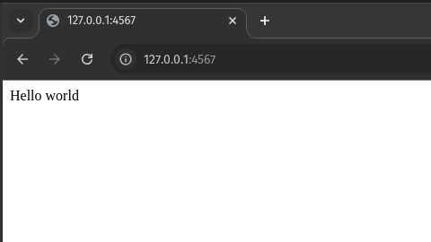

# Learning Sinatra

- [Learning Sinatra](#learning-sinatra)
  - [What is Sinatra?](#what-is-sinatra)
    - [Simple example](#simple-example)
  - [Setup Real-World Project](#setup-real-world-project)
  - [Generate models using ActiveRecord and Rake](#generate-models-using-activerecord-and-rake)
  - [Setup Task model](#setup-task-model)
  - [Manage routes and MVC operations](#manage-routes-and-mvc-operations)
  - [Filters (before/after)](#filters-beforeafter)
  - [Set layouts](#set-layouts)
  - [JSON response](#json-response)
    - [Testing REST API](#testing-rest-api)
  - [Middlewares](#middlewares)
  - [Error handling](#error-handling)
  - [Testing](#testing)
  - [Rack](#rack)
    - [Setup rack with `config.ru`](#setup-rack-with-configru)

## What is Sinatra?

Sinatra is small web development framework, it's a very straight forward framework, that reminds me a bit of express.js

### Simple example

**Creating simple example:**

```rb
# app.rb
require 'sinatra'


get '/' do
  "Hello world"
end
```

**Running example app:**

On the directory root folder your `app.rb` simply run:

```rb
ruby app.rb
```

**Output:**

```mono
== Sinatra (v4.1.0) has taken the stage on 4567 for development with backup from Puma
Puma starting in single mode...
* Puma version: 6.5.0 ("Sky's Version")
* Ruby version: ruby 3.3.0 (2023-12-25 revision 5124f9ac75) [x86_64-linux]
*  Min threads: 0
*  Max threads: 5
*  Environment: development
*          PID: 16294
* Listening on http://127.0.0.1:4567
* Listening on http://[::1]:4567
Use Ctrl-C to stop
```

**On Browser:**



## Setup Real-World Project

The first thing we need to do is to understand how to setup a Sinatra project.

```tree
tasks-manager/
├── app.rb                        # Main entry point of your Sinatra application, where routes and logic are defined.
├── config
│   └── database.yml              # Configuration file for database connection settings (e.g., adapter, database name).
├── db
│   ├── migrate/                  # Directory for ActiveRecord migration files to modify database schema.
│   ├── schema.rb                 # Auto-generated file that holds the current database schema after migrations.
├── Gemfile                       # Specifies the gems your project depends on (e.g., Sinatra, ActiveRecord).
├── models
│   └── task.rb                   # Model file defining the Task class and its interactions with the database.
├── Rakefile                      # Defines Rake tasks, such as database migrations, for your project.
└── views
    ├── layouts
    │   └── app.erb               # Main layout template file that is used by other views.
    └── tasks
        ├── edit.erb              # Template for editing an existing task.
        ├── index.erb             # Template for displaying the list of tasks.
        └── new.erb               # Template for creating a new task.

```

Now lets go through the basic files setup

**Gemfile:**

```Gemfile
source 'https://rubygems.org' # Source of Ruby gems, using the default RubyGems.org.

gem 'sinatra'               # Minimal web framework for routing and request handling.
gem 'sinatra-contrib'       # Extensions for Sinatra, like reloader and namespaces.
gem 'activerecord'          # ORM for database operations and migrations.
gem 'sinatra-activerecord'  # Integrates ActiveRecord with Sinatra for easier setup.
gem 'rake'                  # Since we are using activerecord we use rake tasks to create models and manage database
gem 'sqlite3'               # SQLite database adapter for Ruby, used for persistence.
```

> Notice that in this example we are using activerecord as ORM, due to its robustness, but we could also use other ORM like `sequel`, later we will cover this very setup with **Sequel**

**Main app:**

```rb
# app.rb
require 'sinatra'
require 'sinatra/activerecord'
require 'sinatra/reloader' if development?

set :database, { adapter: 'sqlite3', database: 'db/tasks_manager.sqlite3' }

# Models
require './models/task'

# Routes will be defined here
```

**Database setup:**

```yml
default: &default
  adapter: sqlite3
  pool: 5
  timeout: 5000

development:
  <<: *default
  database: db/tasks_manager.sqlite3
```

**Setup Rake tasks:**

```Rakefile
# Load the necessary gems
require 'sinatra/activerecord/rake'
require './app' # Adjust if your main application file has a different name
```

## Generate models using ActiveRecord and Rake

To be able to generate tables for sinatra using activerecord we use:

```sh
bundle exec rake db:create_migration NAME=create_tasks
```

that will produce a migration just as same as we do with Rails:

```rb
# db/migrate/20250102175627_create_tasks.rb
class CreateTasks < ActiveRecord::Migration[8.0]
  def change
  end
end
```

Within the migration we add the block to create the table using activerecord

```rb
class CreateTasks < ActiveRecord::Migration[8.0]
  def change
    create_table :tasks do |t|
      t.string :title
      t.text :description
      t.boolean :completed, default: false
      t.timestamps
    end
  end
end
```

And then use `migrate` rake to run the migration

```sh
bundle exec rake db:migrate
```

**Output:**

```mono
== 20250102175627 CreateTasks: migrating ======================================
-- create_table(:tasks)
   -> 0.0004s
== 20250102175627 CreateTasks: migrated (0.0004s) =============================
```

## Setup Task model

Since we are using activerecord we have all the good stuff rails also have, such as validations, callbacks and etc..

This is how our simple `Task` model will looks like:

```rb
class Task < ActiveRecord::Base
  validates :title, presence: true
end
```

## Manage routes and MVC operations

Now we got into the part where Sinatra shines on with simplicity, differently than Rails that separates Routes and controllers logics, Sinatra manges to handle MVC operations withing files that holds both together.

**Setup CRUD operations:**

```rb
require 'sinatra/base'
require 'sinatra/activerecord'  # To connect to ActiveRecord
require './models/task'         # Require your Task model

class TasksController < Sinatra::Base
  get '/tasks' do
    @tasks = Task.all
    erb :'tasks/index'
  end

  post '/tasks' do
    task = Task.new(params[:task])
    if task.save
      redirect '/tasks'
    else
      erb :'tasks/new'
    end
  end

  put '/tasks/:id' do
    task = Task.find(params[:id]) 
    if task.update(params[:task]) 
      redirect '/tasks'
    else
      erb :'tasks/edit'
    end
  end
end

```

To ensure that params are correct and follows strong params concept, we will have to add helper block within the controller/route logic:

```rb
# controllers/tasks_controller.rb

require 'sinatra/base'
require 'sinatra/activerecord'  # To connect to ActiveRecord
require './models/task'         # Require your Task model

class TasksController < Sinatra::Base
  helpers do
    def task_params
      params.require(:task).permit(:title, :description)
    end
  end

  get '/tasks' do
    @tasks = Task.all
    erb :'tasks/index'
  end

  post '/tasks' do
    task = Task.new(task_params)
    if task.save
      redirect '/tasks'
    else
      erb :'tasks/new'
    end
  end

  put '/tasks/:id' do
    task = Task.find(params[:id]) 
    if task.update(task_params) 
      redirect '/tasks'
    else
      erb :'tasks/edit'
    end
  end
end
```

> In a Sinatra project is very common to see the controller modules within a folder `routes`, because MVC operations are done within the route itself

**Loading controllers and models:**

Since we keep our controllers as module, to make our app to load the CRUD action we need to add the Controllers to he main `app.rb`

```rb
# app.rb
require 'sinatra/base'
require 'sinatra/activerecord'

# Load models and routes
Dir['./models/*.rb'].each { |file| require file }
Dir['./controllers/*.rb'].each { |file| require file }

class App < Sinatra::Base
  use TasksController
end
```

## Filters (before/after)

Filters are used to modify behavior `before` or `after` a route is processed. They can be used to handle things like authentication, validation, or setup logic.

- `before`: Runs before a route handler is executed.
- `after`: Runs after a route handler has executed and the response is returned.

**Example:**

```rb
# controllers/tasks_controller.rb 

require 'sinatra/base'
require 'sinatra/activerecord'  # To connect to ActiveRecord
require './models/task'         # Require your Task model

class TasksController < Sinatra::Base
  before do
    # Run this before each request to check if the user is authenticated
    redirect '/login' unless logged_in?
  end

  get '/tasks' do
    @tasks = Task.all
    erb :'tasks/index'
  end
end
```

## Set layouts

On Sinatra just like rails we can define layouts while rendering our views:

```rb
require 'sinatra/base'
require 'sinatra/activerecord'  # To connect to ActiveRecord
require './models/task'         # Require your Task model

class TasksController < Sinatra::Base
  # This sets the layout for all routes in the controller
  before do
    set :layout, :tasks  # Set layout to tasks for all routes
  end

  get '/tasks' do
    @tasks = Task.all
    erb :'tasks/index'  # Uses the tasks layout automatically
  end
end
```

## JSON response

```rb
require 'sinatra/base'

class TasksController < Sinatra::Base
  # Set JSON content type
  before do
    content_type :json
  end

  # List tasks
  get '/api/v1/tasks' do
    tasks = Task.all
    json tasks
  end

  # Create task
  post '/api/v1/tasks' do
    task = Task.new(params[:task])
    if task.save
      status 201
      json task
    else
      status 422
      json task.errors.full_messages
    end
  end

  # Update task
  put '/api/v1/tasks/:id' do
    task = Task.find_by(id: params[:id])
    if task&.update(params[:task])
      json task
    else
      status task.nil? ? 404 : 422
      json({ error: task.nil? ? 'Task not found' : task.errors.full_messages })
    end
  end

  # Delete task
  delete '/api/v1/tasks/:id' do
    task = Task.find_by(id: params[:id])
    if task&.destroy
      status 204
    else
      status 404
      json({ error: 'Task not found' })
    end
  end
end
```

### Testing REST API

**1. Start the server:**

```sh
ruby app.rb
```

**2. Get tasks:**

```sh
curl -X GET http://localhost:4567/tasks

```

**3. Create a task:**

```sh
curl -X POST -H "Content-Type: application/json" -d '{"task": {"title": "New Task", "done": false}}' http://localhost:4567/tasks
```

## Middlewares

Real-world applications often use middleware for logging, security, authentication, or request parsing. To add a middleware we use the `use` statement:

```rb
require 'sinatra/base'
require 'sinatra/activerecord'
require 'sinatra/json'
require 'rack/protection'

# Load models and controllers
Dir['./models/*.rb'].each { |file| require file }
Dir['./controllers/*.rb'].each { |file| require file }

class App < Sinatra::Base
  # Use Rack middleware for security
  use Rack::Protection

  # Database configuration
  set :database, { adapter: 'sqlite3', database: 'db/tasks_manager.sqlite3' }

# Mount routes from TasksController
  use TasksController
end
```

## Error handling

Another important step on creating a real-world sinatra project is to handle basic errors, like 404 and 500.

```rb
require 'sinatra/base'
require 'sinatra/activerecord'
require 'sinatra/json'
require 'rack/protection'

# Load models and controllers
Dir['./models/*.rb'].each { |file| require file }
Dir['./controllers/*.rb'].each { |file| require file }

class App < Sinatra::Base
  # Use Rack middleware for security
  use Rack::Protection

  # Database configuration
  set :database, { adapter: 'sqlite3', database: 'db/tasks_manager.sqlite3' }

  # Error handling
  error 404 do
    json({ error: 'Not Found' })
  end

  error 500 do
    json({ error: 'Internal Server Error' })
  end

  # Mount routes from TasksController
  use TasksController
end

```

## Testing

**Setup test engine:**

on Gemfile

```Gemfile
group :test do
  gem 'rack-test'
  gem 'rspec'
end
```

**Test folder structure:**

```tree
tasks-manager/
├── spec
│   ├── controllers
│   │   └── tasks_controller_spec.rb  # Tests for tasks controller
│   └── spec_helper.rb                # RSpec configuration
```

**Setup RSPEC:**

```rb
# spec/spec_helper.rb
require 'sinatra'
require 'rack/test'
require 'rspec'

# Configure RSpec to include Sinatra helpers directly
RSpec.configure do |config|
  config.include Rack::Test::Methods  # Sinatra helpers included directly
  config.include RSpecMixin  # If you have your own helpers

  # Helper to initialize the app (sinatra)
  def app
    Sinatra::Application
  end
end
```

**Test example for ERB response:**

```rb
# spec/controllers/task_controller_spec.rb
require 'spec_helper'

RSpec.describe 'TaskController' do
  context 'GET /tasks' do
    it 'returns an HTML response (ERB)' do
      get '/tasks'

      expect(last_response).to be_ok  # HTTP status 200
      expect(last_response.body).to include('Tasks List')  # Expect the content rendered by the view
    end
  end
end
```

**Test example for JSON response:**

```rb
# spec/controllers/task_controller_json_spec.rb
require 'spec_helper'

RSpec.describe 'TaskController' do
  context 'GET /tasks' do
    it 'returns a JSON response' do
      get '/tasks', {}, { 'HTTP_ACCEPT' => 'application/json' }  # Set the Accept header for JSON

      expect(last_response).to be_ok  # HTTP status 200
      expect(last_response.content_type).to eq('application/json')  # Ensure it's JSON
      expect(JSON.parse(last_response.body)).to be_an(Array)  # Expect the response body to be an array (example structure)
    end
  end
end
```

## Rack

You must have noticed that we are using Rack dependencies in various situations.

**Rack** is a lightweight and modular interface for Ruby web frameworks, such as Sinatra, Rails, and others. It standardizes how web servers interact with applications, enabling middleware and frameworks to work seamlessly together.

- Purpose: It acts as a bridge between web servers (e.g., Puma, Thin) and Ruby web frameworks.
- Convention: The interface expects the application to respond to a call method that returns a three-element array: [status, headers, body].

For Sinatra, Rack is the underlying engine that processes HTTP requests and responses, making it easy to plug middleware and custom logic into the request/response cycle.

A realistic gemfile would look some what like this:

```Gemfile
source 'https://rubygems.org' # Source of Ruby gems, using the default RubyGems.org.

# Sinatra framework
gem 'sinatra'               # Core web framework built on Rack
gem 'sinatra-contrib'       # Extensions like sinatra/reloader, JSON support

# Database (ActiveRecord as an example ORM)
gem 'activerecord'          # ORM for database management
gem 'sinatra-activerecord'  # Integration of ActiveRecord with Sinatra
gem 'sqlite3'               # SQLite database driver
gem 'rake'                  # Since we are using activerecord we use rake tasks to create models and manage database

# Rack dependencies
gem 'rack'                  # Rack core library: middleware interface for Ruby web applications
gem 'rack-protection'       # Middleware to enhance security against common web vulnerabilities

group :test do
  gem 'rack-test'           # For testing Rack applications, simulates HTTP requests
  gem 'rspec'               # RSpec for writing test cases
end
```

### Setup rack with `config.ru`

In a Sinatra application, the `config.ru` file is used to set up and configure the **Rack** application. It tells Rack how to start and run your web application, linking it with the Rack server.

`config.ru` configures the application for Rack-based servers: Rack-based servers (like Puma, WEBrick, or Thin) look for this file to load and start the application.

**Create `config.ru`:**

```ru
# config.ru
require './app'  # Loads the main application file, where routes and logic are defined
run Sinatra::Application  # Starts Sinatra as a Rack application
```

**Running application through `rackup`:**

To run your Sinatra app via a Rack-based server (e.g., Puma), use:

```sh
rackup config.ru  # Rack will use config.ru to run the app
```
